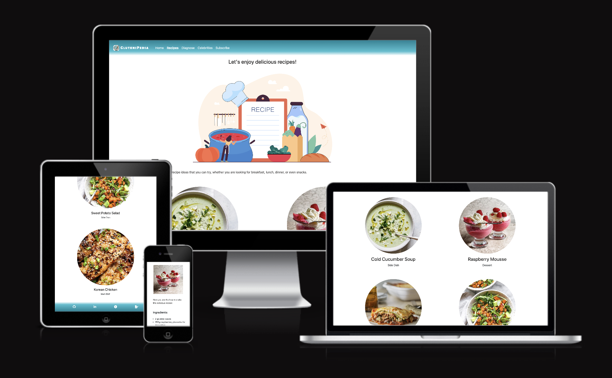
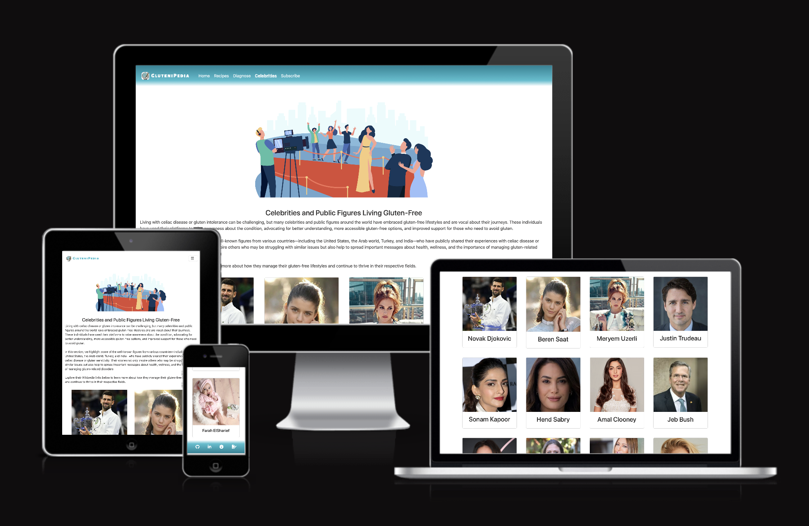
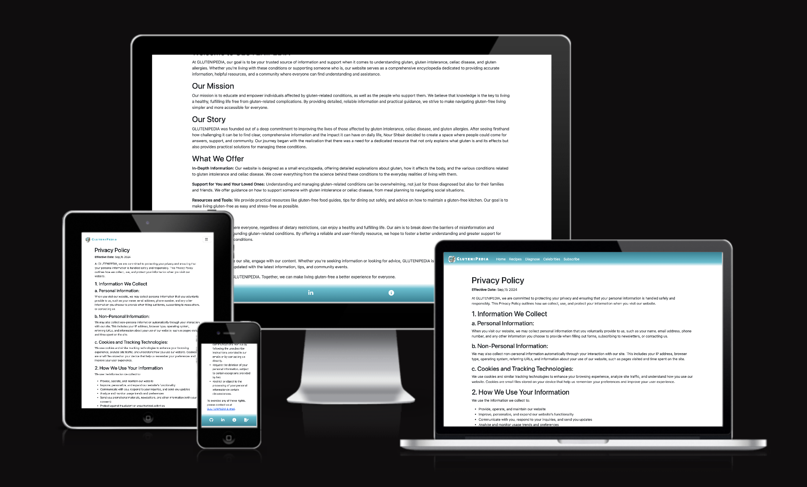
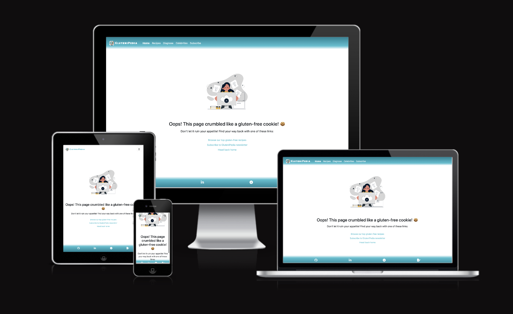

# [GLUTENIPEDIA](https://nourshbair.github.io/GluteniPedia)

Welcome to **GluteniPedia**!

**GluteniPedia** is your go-to online encyclopedia designed to make life easier for people with celiac disease, gluten intolerance, or gluten allergies, as well as their families, friends, and caregivers. We provide reliable, easy-to-understand information about gluten-free living, from dietary tips to managing health risks, and everything in between. Our mission is to empower individuals to make informed decisions and navigate a gluten-free lifestyle with confidence. Whether you’re newly diagnosed or a long-time gluten-free advocate, GluteniPedia is here to support you every step of the way.

source: [amiresponsive](https://ui.dev/amiresponsive?url=https://nourshbair.github.io/GluteniPedia)

## UX
At **GluteniPedia**, we focus on providing a seamless and user-friendly experience for everyone dealing with gluten-related challenges. Our platform is built to make the navigation of gluten-free living as straightforward and supportive as possible.

Key aspects of our user experience include:

• **Intuitive Design:** We’ve crafted a clean, easy-to-navigate interface that allows users to browse through articles and resources effortlessly, ensuring that the information you need is always just a click away.

• **Accessible to All:** We are committed to making GluteniPedia accessible to everyone, adhering to web accessibility standards (WCAG). Our platform is designed with readability and usability in mind, including clear typography, responsive design, and optimal performance on both desktop and mobile devices.

• **Subscribe to Our Newsletter:** Stay updated with the latest information, tips, and gluten-free resources by subscribing to our newsletter. We regularly share valuable content to help you navigate your gluten-free journey with ease.

At **GluteniPedia**, we aim to create a reliable and supportive platform that empowers you with the knowledge and tools you need to thrive in a gluten-free lifestyle.

## Colour Scheme
- `#000000` used for primary text.
- `#FFFFFF` used for primary background.
- `#FFFFFF` used for secondary text.
- `#088395` used for secondary background.
- `#04444D` used for highlighted text.

I used [coolors.co](https://coolors.co/000505-088395-fefcfd) to generate my colour palette.

## Typography
- [Alegreya Sans SC](https://fonts.google.com/specimen/Alegreya+Sans+SC?query=Alegreya) was used for the primary font of the site.
- [Font Awesome](https://fontawesome.com) icons were used throughout the site, such as the social media icons in the footer.

## Features
**GluteniPedia** offers a range of features designed to provide comprehensive support and information for anyone navigating a gluten-free lifestyle. Here’s an overview of what you can find on our platform
### Existing Features

- **What is Gluten?**

    - Get a clear and detailed explanation of what gluten is, where it’s commonly found, and how it affects people with celiac disease, gluten intolerance, or gluten sensitivity. This section serves as an essential guide for understanding the basics of gluten.

- **Diagnosing Gluten-Related Conditions**

    - Explore the different methods and tests used to diagnose gluten-related diseases like celiac disease and gluten sensitivity. We provide information on symptoms to watch for, medical tests available, and the steps involved in obtaining an accurate diagnosis.

- **Gluten-Free Recipes**

    - Discover a variety of delicious, easy-to-follow gluten-free recipes that cater to different tastes and dietary needs. From snacks to full meals, our recipe section is packed with creative ideas to make gluten-free living both healthy and enjoyable.

- **Celebrities on a Gluten-Free Diet**

    - Learn about well-known celebrities and public figures who follow a gluten-free diet, and how they manage their lifestyle choices. This section serves as both inspiration and a reminder that a gluten-free diet can be adopted by anyone.

- **Brands Supporting Gluten-Free Options**

    - Stay informed about brands that offer gluten-free products. We showcase a variety of companies committed to providing safe, gluten-free options for those with dietary restrictions, making your shopping experience easier.

- **Subscribe to Our Newsletter**

    - Never miss an update! Subscribe to our newsletter to receive the latest articles, recipes, and tips on gluten-free living directly in your inbox. Our newsletter is designed to keep you informed and inspired on your gluten-free journey.

- **About Page**

    - Learn more about **GluteniPedia**, our mission, and the team behind the platform. Our About page provides insight into why we created this platform and how we strive to make a positive impact on the lives of individuals dealing with gluten-related conditions.

- **Privacy Policy Page**

    - Your privacy matters to us. Our Privacy Policy page details how we collect, use, and protect your personal information when you use GluteniPedia. We are committed to maintaining the confidentiality of our users and ensuring a secure browsing experience.

- **Error Page**

    - If you happen to land on a page that doesn’t exist, don’t worry! Our custom error page will help guide you back to the right place, ensuring a smooth and frustration-free browsing experience.

GluteniPedia is designed to be a one-stop resource for all things gluten-related, offering information, support, and inspiration for anyone affected by gluten-related health issues or those supporting someone who is.

### Future Features
- RTL Support: Arabic Language
    - To make GluteniPedia accessible to a wider audience, we plan to introduce full Arabic language support, which includes implementing a Right-to-Left (RTL) layout for optimal readability. This change will allow us to cater to Arabic-speaking individuals and ensure that the website functions seamlessly in both languages, offering the same great experience regardless of the user’s language preference. This involves adapting the site’s design, text alignment, and navigation to properly support RTL content.
- Community for Users
    - We understand the importance of connecting with others who share similar experiences. Soon, we will introduce a dedicated community space where users can share their personal stories, tips, and experiences with gluten-free living. Additionally, users will be able to upload and exchange gluten-free recipes, creating a collaborative environment for sharing ideas and support.
- Gluten-Free Restaurants Section
    - Dining out can be challenging for those on a gluten-free diet, which is why we are planning to introduce a dedicated section featuring restaurants that offer gluten-free options. This feature will allow users to easily find and explore dining establishments that cater to their dietary needs, making eating out a more enjoyable and worry-free experience.

## Tools & Technologies Used
-  used to generate README and TESTING templates.
-  used for version control. (`git add`, `git commit`, `git push`)
-  used for secure online code storage.
-  used as my local IDE for development.
-  used for the main site content.
-  used for the main site design and layout.
-  used for hosting the deployed front-end site.
-  used as the front-end CSS framework for modern responsiveness and pre-built components.
-  used for the icons.
-  used to help debug, troubleshoot, and explain things.

## Testing
> [!NOTE]  
> For all testing, please refer to the [TESTING.md](TESTING.md) file.

## Deployment

The site was deployed to GitHub Pages. The steps to deploy are as follows:

- In the [GitHub repository](https://github.com/NourShbair/GluteniPedia), navigate to the Settings tab 
- From the source section drop-down menu, select the **Main** Branch, then click "Save".
- The page will be automatically refreshed with a detailed ribbon display to indicate the successful deployment.

The live link can be found [here](https://nourshbair.github.io/GluteniPedia)

### Local Deployment

This project can be cloned or forked in order to make a local copy on your own system.

#### Cloning

You can clone the repository by following these steps:

1. Go to the [GitHub repository](https://github.com/NourShbair/GluteniPedia) 
2. Locate the Code button above the list of files and click it 
3. Select if you prefer to clone using HTTPS, SSH, or GitHub CLI and click the copy button to copy the URL to your clipboard
4. Open Git Bash or Terminal
5. Change the current working directory to the one where you want the cloned directory
6. In your IDE Terminal, type the following command to clone my repository:
	- `git clone https://github.com/NourShbair/GluteniPedia.git`
7. Press Enter to create your local clone.

Alternatively, if using Gitpod, you can click below to create your own workspace using this repository.

Please note that in order to directly open the project in Gitpod, you need to have the browser extension installed.
A tutorial on how to do that can be found [here](https://www.gitpod.io/docs/configure/user-settings/browser-extension).

#### Forking

By forking the GitHub Repository, we make a copy of the original repository on our GitHub account to view and/or make changes without affecting the original owner's repository.
You can fork this repository by using the following steps:

1. Log in to GitHub and locate the [GitHub Repository](https://github.com/NourShbair/GluteniPedia)
2. At the top of the Repository (not top of page) just above the "Settings" Button on the menu, locate the "Fork" Button.
3. Once clicked, you should now have a copy of the original repository in your own GitHub account!

## Credits

- [Freepik](https://www.freepik.com) used as a source of all cartoon pics in the site.

- [CODEPEN](https://codepen.io/gradar/pen/BaavLLo) helped in implementation of slideshow using HTML and CSS only.

- [Skinnytaste](https://www.skinnytaste.com/recipes/gluten-free/) used as a source of  gluten-free recipes.

### Content

| Source | Location | Notes |
| --- | --- | --- |
| [Markdown Builder](https://tim.2bn.dev/markdown-builder) | README and TESTING | tool to help generate the Markdown files |
| [Bootstrap](https://getbootstrap.com/docs/5.3/components/navbar/#how-it-works) | Entire Site | responsive navbar |
| [Bootstrap](https://getbootstrap.com/docs/5.3/layout/grid/#nesting) | Home - Celebrities - Recipes Pages | responsive grid |
| [W3Schools](https://www.w3schools.com/cssref/sel_target.php) | Recipes Page | redirct to recipe page using #id and :target |
| [LoveRunning](https://github.com/Code-Institute-Solutions/love-running-v3) | Subscription Page | get inspired by the form used in LoveRunning app |
| [CODEPEN](https://codepen.io/gradar/pen/BaavLLo) | Home Page | brands slideshow with HTML and CSS only |
| [CODEPEN](https://codepen.io/gradar/pen/BaavLLo) | Confirm Subscription Page | countdown with HTML and CSS only |
| [Youtube](https://www.youtube.com/watch?v=-TCcJ4ap05o) | Navbar Menu Button | Collapsible DIV With HTML CSS Only |

### Acknowledgements

- I would like to thank my partner [Ahmad ElShareif](https://github.com/Ahmah2009), for always believing in me, and encouraging me to make this 'transition' into web development.
- I would like to thank my Code Institute mentor, [Tim Nelson](https://github.com/TravelTimN) for his support throughout the development of this project.
- I would like to thank the [Code Institute](https://codeinstitute.net) tutor team for their assistance with troubleshooting and debugging some project issues.
- I would like to thank the [Code Institute Slack community](https://code-institute-room.slack.com) for the moral support; it kept me going during periods of self doubt and imposter syndrome.
